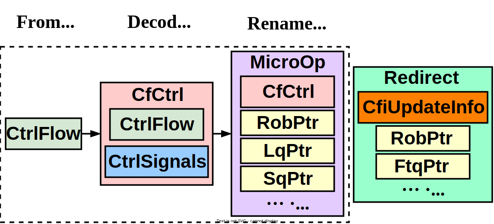
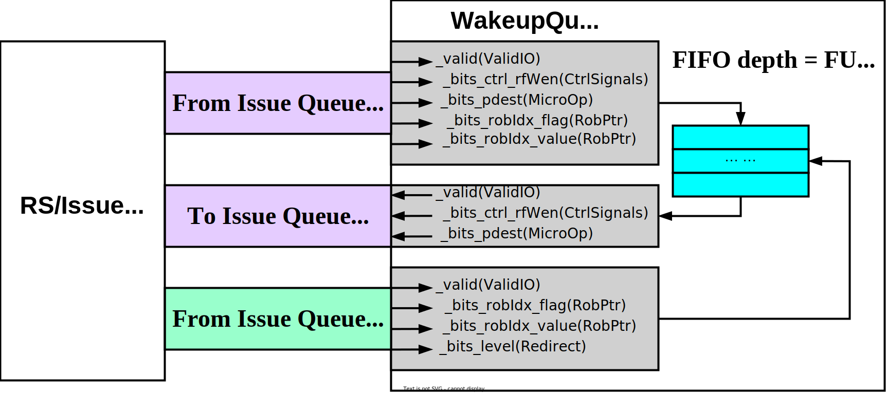

# Xiangshan-Nanhu 唤醒机制

> 由于master分支里kunminghu uarch没有把WakeupQueue.scala删除，误以为这个文件被使用作为Kunminghu唤醒机制部分，后俩发现是Nanhu余孽，因此本文档分析的是Nanhu架构的WakeupQueue，用于一般快速唤醒机制，但是用的其他class之类的代码是Kunminghu主分支的，接口是对得上的但是没有被使用了，因此简单描述一下。

## 写回唤醒

待续

## 一般快速唤醒 

### Fastwake WakeupQueue 唤醒队列

> 《超标量-姚》唤醒的定义：将被select电路选中的指令的目的寄存器编号和issue queue (RS) 中的其他源寄存器的编号对比（面积大），将相等的源寄存器进行标记的过程。

#### Module

```scala
class WakeupQueue(number: Int)(implicit p: Parameters) extends XSModule {}
```

#### I/O

```scala
/* 
    type ValidIO[+T <: Data] = Valid[T]
    Synonyms, moved from main package object - maintain scope.
    https://github.com/chipsalliance/chisel/blob/main/src/main/scala/chisel3/util/util.scala
*/
val io = IO(new Bundle {
  val in  = Flipped(ValidIO(new MicroOp))
  val out = ValidIO(new MicroOp)
  val redirect = Flipped(ValidIO(new Redirect))
}
```

|        Signal        | Direction  | Width |    Source     |    Target     |                       Description                        |
| :------------------: | :--------: | :---: | :-----------: | :-----------: | :------------------------------------------------------: |
|       `clock`        |   input    |   1   |       -       | `WakeupQueue` |                                                          |
|       `reset`        |   input    |   1   |       -       | `WakeupQueue` |                                                          |
|      **io_in**       | **input**  |       |               |               | 使用`IusseQueue`入队的uop信号作为`WakeupQueue`的入队信号 |
|       `_valid`       |   input    |   1   | `IusseQueue`  | `WakeupQueue` |               `WakeupQueue`的入队信号有效                |
|  `_bits_ctrl_rfWen`  |   input    |   1   | `IusseQueue`  | `WakeupQueue` |                                                          |
|    `_bits_pdest`     |   input    | [7:0] | `IusseQueue`  | `WakeupQueue` |                                                          |
| `_bits_robIdx_flag`  |   input    |   1   | `IusseQueue`  | `WakeupQueue` |                                                          |
| `_bits_robIdx_value` |   input    | [7:0] | `IusseQueue`  | `WakeupQueue` |                                                          |
|      **io_out**      | **output** |       |               |               |        `WakeupQueue`的出队信号，用于唤醒相应的uop        |
|       `_valid`       |   output   |   1   | `WakeupQueue` | `IusseQueue`  |                       出队信号有效                       |
|  `_bits_ctrl_rfWen`  |   output   |   1   | `WakeupQueue` | `IusseQueue`  |                                                          |
|    `_bits_pdest`     |   output   | [7:0] | `WakeupQueue` | `IusseQueue`  |                                                          |
|   **io_redirect**    | **input**  |       |               |               |             用于冲刷WakeupQueue的重定向信号              |
|       `_valid`       |   input    |   1   | `IusseQueue`  | `WakeupQueue` |                       冲刷信号有效                       |
| `_bits_robIdx_flag`  |   input    |   1   | `IusseQueue`  | `WakeupQueue` |                                                          |
| `_bits_robIdx_value` |   input    | [7:0] | `IusseQueue`  | `WakeupQueue` |                                                          |
|    `_bits_level`     |   input    |   1   | `IusseQueue`  | `WakeupQueue` |                                                          |

#### 一些重要的 Class

> 图还是直接看drawio里的，我画的时候用的google导入字体和非格式化文本下很小的字号，svg渲染有问题。画Kunminghu时这个坑就不会踩了。



#### RS <> WakeupQueue



#### Function

```scala
  if (number < 0) {
    io.out.valid := false.B
    io.out.bits := DontCare
  } else if(number == 0) {
    io.in <> io.out
    io.out.valid := io.in.valid
    // NOTE: no delay bypass don't care redirect
  } else {
    val queue = Seq.fill(number)(RegInit(0.U.asTypeOf(new Bundle{
      val valid = Bool()
      val bits = new MicroOp
    })))
    queue(0).valid := io.in.valid && !io.in.bits.robIdx.needFlush(io.redirect)
    queue(0).bits  := io.in.bits
    (0 until (number-1)).map{i =>
      queue(i+1) := queue(i)
      queue(i+1).valid := queue(i).valid && !queue(i).bits.robIdx.needFlush(io.redirect)
    }
    io.out.valid := queue(number-1).valid
    io.out.bits := queue(number-1).bits

    // debug

    // for (i <- 0 until number) {
    //   XSDebug(queue(i).valid, p"BPQue(${i.U}): pc:${Hexadecimal(queue(i).bits.cf.pc)} robIdx:${queue(i).bits.robIdx}" +
    //     p" pdest:${queue(i).bits.pdest} rfWen:${queue(i).bits.ctrl.rfWen} fpWen:${queue(i).bits.ctrl.fpWen} vecWen:${queue(i).bits.ctrl.vecWen}\n")
    // }
  }
```

* `WakeupQueue` 模块是个FIFO，在uop入队后延迟一定的周期数出队。
* 如果在 `IusseQueue` 里配置了 `fixedLatency` 参数，则会实例化 `numDeq` 个 `WakeupQueue`。
* uop从 `IusseQueue` 出队送进FU执行时，也同时会被送入 `WakeupQueue`。当uop执行完毕，`WakeupQueue` 的延迟出队信号也同时有效，用于唤醒其它uop参与调度执行。
* 当重定向信号有效时，将会冲刷晚于ROB指针（是否等于由level信号指定）进入ROB的uop。

### Tips: CircularQueuePtr 循环队列指针

> 一个经常用到的 FIFO ptr Class

```scala
package utility

import org.chipsalliance.cde.config.Parameters
import chisel3._
import chisel3.util._

class CircularQueuePtr[T <: CircularQueuePtr[T]](val entries: Int) extends Bundle {

  def this(f: Parameters => Int)(implicit p: Parameters) = this(f(p))
  // 指针深度 (Scala type)
  val PTR_WIDTH = log2Up(entries)
  // 标志位
  val flag = Bool()
  // 存储的value表示指针当前位置
  val value = UInt(PTR_WIDTH.W)

  override def toPrintable: Printable = {
    p"$flag:$value"
  }

  // 用final修饰的类：不能被继承
  // 用final修饰的方法：不能被重写

  // 指针运算符 '+' 重载
  final def +(v: UInt): T = {
    val entries = this.entries
    val new_ptr = Wire(this.asInstanceOf[T].cloneType)
    // 指针所指队列的条目总数是2的幂 此时 指针能表示的最大value === 循环临界
    if(isPow2(entries)){
      new_ptr := (Cat(this.flag, this.value) + v).asTypeOf(new_ptr)
      /*
        assert(new_ptr.flag === this.flag)
        assert(new_ptr.value === this.value + v)
      */
    // 指针所指队列的条目总数不是2的幂 此时 PTR_WIDTH 会向上取1, 有很多用不到的value值，不能直接+来跳到下个循环, 此时 entry数 === 循环临界
    } else {
      // +& 位宽推理为 max(w(this.value), w(v)) + 1
      val new_value = this.value +& v
      // diff 主要计算指针 + 后是否超过深度，高位cat一位0用于正数补码 转SInt
      val diff = Cat(0.U(1.W), new_value).asSInt - Cat(0.U(1.W), entries.U.asTypeOf(new_value)).asSInt
      // 越界标志位，此时指针开始下个循环
      val reverse_flag = diff >= 0.S
      // Mux(select, 1_sig, 0_sig)
      new_ptr.flag := Mux(reverse_flag, !this.flag, this.flag)
      new_ptr.value := Mux(reverse_flag,
        // 下个循环的value
        diff.asUInt,
        // 未越界
        new_value
      )
    }
    new_ptr
  }

  final def -(v: UInt): T = {
    // 直接复用重载后的 '+'
    /*
      example:
        this.ptr_value === 136 (entries === 256), v = 30
        this.value(this - v)
          === this + (256 - 30)
          === this + 226 // 136 + 226 - 256 > 0 flag = !flag

        this.ptr_value === 136 (entries === 150), v = 140
        this.value(this - v)
          === this + (150 - 140)
          === this + 10 // 136 + 10 - 150 < 0 flag = flag
    */
    val flipped_new_ptr = this + (this.entries.U - v)
    val new_ptr = Wire(this.asInstanceOf[T].cloneType)
    /*
      example:
        this.ptr_value === 136 (entries === 256), v = 30
        this.flag = this.!!flag
        this.ptr_value === 136 (entries === 150), v = 140
        this.flag = !this.flag
    */
    new_ptr.flag := !flipped_new_ptr.flag
    new_ptr.value := flipped_new_ptr.value
    new_ptr
  }

  final def === (that: T): Bool = this.asUInt === that.asUInt

  final def =/= (that: T): Bool = this.asUInt =/= that.asUInt

  // 相同flag时，大的大，小的小
  // 不同flag时，大的小，小的大
  final def > (that: T): Bool = {
    val differentFlag = this.flag ^ that.flag
    val compare = this.value > that.value
    differentFlag ^ compare
  }

  final def < (that: T): Bool = {
    val differentFlag = this.flag ^ that.flag
    val compare = this.value < that.value
    differentFlag ^ compare
  }

  final def >= (that: T): Bool = {
    val differentFlag = this.flag ^ that.flag
    val compare = this.value >= that.value
    differentFlag ^ compare
  }

  final def <= (that: T): Bool = {
    val differentFlag = this.flag ^ that.flag
    val compare = this.value <= that.value
    differentFlag ^ compare
  }
  // def apply(in: UInt, width: Int): UInt = width match {}
  def toOH: UInt = UIntToOH(value, entries)
}

trait HasCircularQueuePtrHelper {
  // 是否为空
  // enq_ptr 入队指针
  // deq_ptr 出队指针
  def isEmpty[T <: CircularQueuePtr[T]](enq_ptr: T, deq_ptr: T): Bool = {
    enq_ptr === deq_ptr
  }
  // 是否为满
  def isFull[T <: CircularQueuePtr[T]](enq_ptr: T, deq_ptr: T): Bool = {
    (enq_ptr.flag =/= deq_ptr.flag) && (enq_ptr.value === deq_ptr.value)
  }
  // 出入队指针距离
  def distanceBetween[T <: CircularQueuePtr[T]](enq_ptr: T, deq_ptr: T): UInt = {
    assert(enq_ptr.entries == deq_ptr.entries)
    Mux(enq_ptr.flag === deq_ptr.flag,
      enq_ptr.value - deq_ptr.value,
      enq_ptr.entries.U + enq_ptr.value - deq_ptr.value)
  }
  // 是否有free条目
  def hasFreeEntries[T <: CircularQueuePtr[T]](enq_ptr: T, deq_ptr: T): UInt = {
    val free_deq_ptr = enq_ptr
    val free_enq_ptr = WireInit(deq_ptr)
    free_enq_ptr.flag := !deq_ptr.flag
    distanceBetween(free_enq_ptr, free_deq_ptr)
  }

  def isAfter[T <: CircularQueuePtr[T]](left: T, right: T): Bool = left > right

  def isBefore[T <: CircularQueuePtr[T]](left: T, right: T): Bool = left < right

  def isNotAfter[T <: CircularQueuePtr[T]](left: T, right: T): Bool = left <= right

  def isNotBefore[T <: CircularQueuePtr[T]](left: T, right: T): Bool = left >= right
}

```

## LoadUnit 快速唤醒

待续